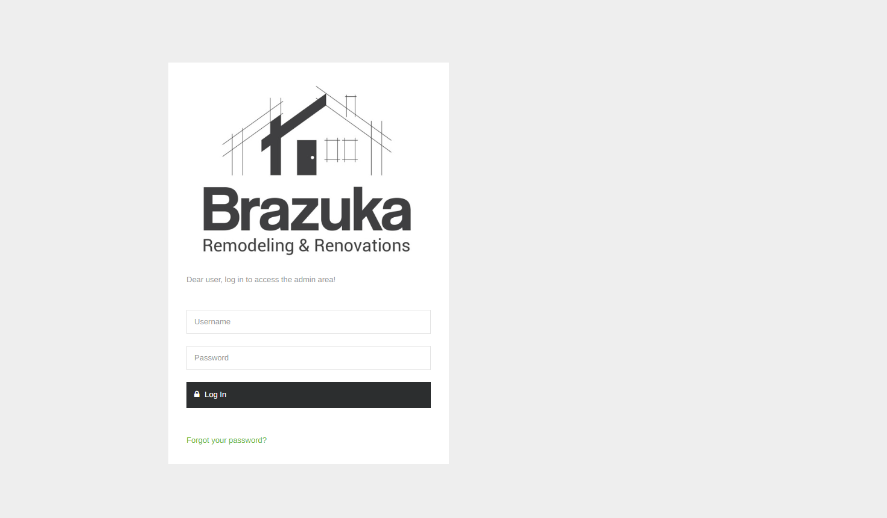

# Brazuka remodeling renovations
Esse sistema foi desenvolvido e implantado exclusivamente para a empresa "Brazuka", uma empresa que prestas serviços de construções/reformas, atuando nos EUA em Oklahoma.

# Tela inicial

### Funcionalidades 

- Gerenciamento de clientes
- Gerenciamento de funcionários
- Gerenciamento de serviços (+ controle de pagamentos do serviço, controle de pagamentos de funcionários, serviços adicionais, etc...)
- Gerenciamento de fluxo de caixa (entradas e saídas financeiras)
- Gerenciamentos de usuários (+ permissões)
- Uploads e downloads de documentações 
- Integrações via e-mail 
- Integrações com os usuários do sistema

### Tecnologias utilizadas 

- Bootstrap (Framework) 
- JavaScript
- jQuery
- Ajax
- PHP CodeIgniter4 (Framework)
- MySQL (Banco de dados)

